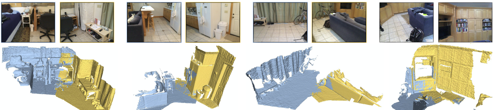
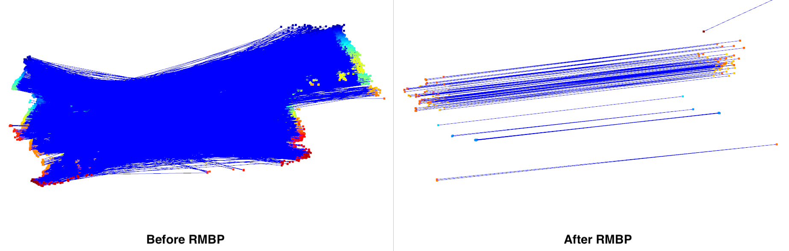

# RMBP

Robust Matching using Belief Propagation (RMBP) is an implementation the **ECCV 2018 paper** -

["Learning and Matching Multi-View Descriptors for Registration of Point Clouds"](https://arxiv.org/pdf/1807.05653.pdf), [Lei Zhou](https://zlthinker.github.io/), Siyu Zhu, Zixin Luo, Tianwei Shen, Runze Zhang, Mingmin Zhen, Tian Fang, Long Quan.

If you find this project useful, please cite:
```
@inproceedings{zhou2018learning,
  title={Learning and matching multi-view descriptors for registration of point clouds},
  author={Zhou, Lei and Zhu, Siyu and Luo, Zixin and Shen, Tianwei and Zhang, Runze and Zhen, Mingmin and Fang, Tian and Quan, Long},
  booktitle={Proceedings of the European Conference on Computer Vision (ECCV)},
  year={2018}
}
```

## Introduction

RMBP is a robust matching approach, aiming at rejecting outlier 2D or 3D keypoint matches based on the efficient inference via belief propagation on the defined graphical model.
Therefore, it can contribute to the robustness of point cloud registration and image matching. As shown below, RMBP facilitates the registration of point clouds with deficient geometric overlap although the outlier matches outnumber the inlier matches greatly.



We enable the application of RMBP in two scenarios in this repository: 3D-3D matching and 2D-2D matching, which correspond to the ```matster``` and ```2D-2D``` branches respectively. 

## Dependencies
* Cmake
* OpenMP
* If you would like to use the scripts in the folder ```python/```, please install the necessary packages listed in ```python/requirements.txt```.

## Build
Build like any other cmake project.

```
mkdir build & cd build
cmake ..
make -j
```

## Run test code

### Command

The command is in the form of ```./RMBP <path_to_match_file> <path_to_save_match_file> --belief <belief_threshold> --iteration <iteration_number>```
* ```<belief_threshold>``` is the threshold distinguishing an inlier or outlier. A match pair will be seen as an outlier if its belief is smaller than <belief_threshold>,
* ```<iteration_number>``` is the number of iterations belief propagation will run.

### 3D-3D matching

* In the `test/3D-3D` folder are a list of match files for demo. They first write the match number `N`, followed by `N` lines that denote `x`, `y`, `z` of the two corresponding points in two point clouds and the initial probability of being an inlier for the match pair which may be estimated from their measurements like similarity.
The first 150 match pairs are inliers while the others are outliers. The demo outputs the belief of being an inlier for each match pair and the refined match pairs given the belief threshold.

* Run the program following the steps below.
```
git checkout master
mkdir build && cd build && cmake .. && make -j
./RMBP ../test/3D-3D/match_file_inlier_ratio_4.txt  ../test/3D-3D/match_file_inlier_ratio_4_RMBP.txt --belief 0.45
```

* You can visualize the matching results by running the script ```python python/draw_3d_matches.py <path_to_match_file>``` which will show the visualization results as below.




### 2D-2D matching

* In the `test/2D-2D` folder are two examplar images ```0002.png``` and ```0007.png``` from the [castle-P30 dataset](https://icwww.epfl.ch/multiview/denseMVS.html).
The putative matches between the two images are saved in the file ```putative_matches.txt``` by running the script ```python python/feature_2d_matching.py test/2D-2D/0002.png test/2D-2D/0007.png --output  test/2D-2D/putative_matches.txt```.

* Run the program following the steps below.
```
git checkout 2D-2D
mkdir build && cd build && cmake .. && make -j
./RMBP ../test/2D-2D/putative_matches.txt  ../test/2D-2D/putative_matches_RMBP.txt --belief 0.45
```

* You can visualize the matching results by running the script ```python python/draw_2d_matches.py test/2D-2D/0002.png test/2D-2D/0007.png <path_to_match_file>``` which will show the visualization results as below.


